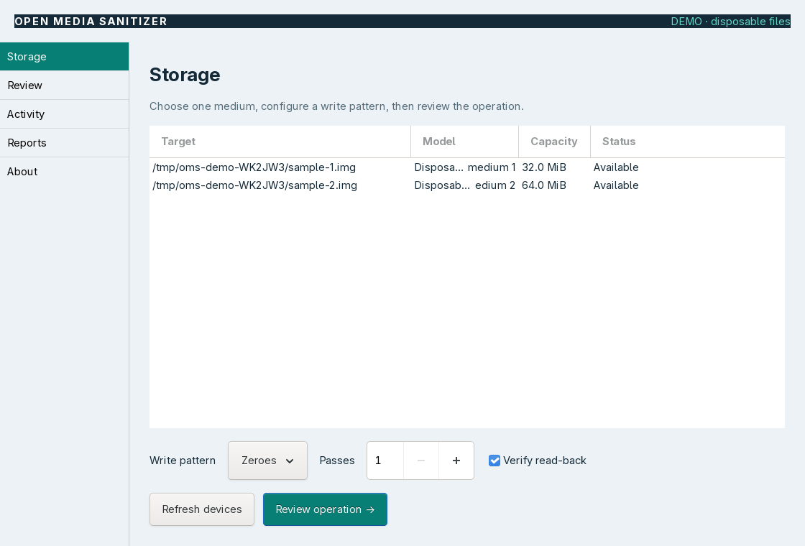

# Open Media Sanitizer

Open Media Sanitizer is a native C Linux desktop workspace for selecting storage media, reviewing an erase operation, following its progress, and exporting a record. The GTK desktop (`oms-gui`), command-line backend (`oms`), and report generator are written in C. No Python application or interpreter is needed at runtime. The interface uses a slate-and-teal theme with no bundled image assets.

The project is at an early stage. Use it only after reviewing the source and testing the workflow in an environment where data loss is acceptable.



## Open the app

Install the system dependencies once:

```sh
# Debian / Ubuntu
sudo apt install build-essential pkg-config libgtk-3-dev libjson-glib-dev librsvg2-common shared-mime-info adwaita-icon-theme

# Arch Linux
sudo pacman -S --needed base-devel pkgconf gtk3 json-glib

# Fedora
sudo dnf install gcc make pkgconf-pkg-config gtk3-devel json-glib-devel
```

From this checkout, open a working demonstration:

```sh
./start.sh --demo
```

The launcher builds both C executables and opens the desktop window. No pip, npm,
account, network service, or application installation is needed. Demo mode
creates two disposable files and runs the real write and read-back verification
code only on those files. They are removed when the app closes.

To inspect real devices, open `./start.sh`. Choose **Storage → select a medium →
Review operation**, then type its complete path. Physical erasure requires root:
after building as your regular user, launch `sudo -E ./start.sh` from a trusted
graphical desktop session. The launcher never elevates itself or builds as root.
If your desktop does not permit root windows, use the CLI below for execution.

**Activity** shows write and verification progress and supports cancellation.
**Reports** exports completed, failed, and cancelled operation records as JSON
or a standalone HTML page that can also be printed to PDF. Records include the
target, timing, settings, outcome, and verification result. Demo records are
explicitly marked. Records are kept in memory until exported.

Keyboard users can navigate with Tab and activate controls with Space/Enter.
If no graphical display is available, the launcher prints an explanation and
the CLI remains available. The current interface is in English.

See the [review notes](docs/review.md) for corrected issues, test coverage, and limits.

## Boot without an installed OS

See [standalone boot media](docs/boot-images.md) for the x86 32-bit, x86 64-bit,
ARM 32-bit, and ARM 64-bit image builds and their firmware requirements.

## Safety model

- There is no command that erases every detected device.
- `oms erase` is a dry run unless `--execute` is present.
- Execution requires the canonical target path to be typed interactively or supplied with `--confirm`.
- Mounted devices, active swap devices, read-only devices, and devices with active holders are rejected.
- The target is inspected again after confirmation and checked again after opening.
- The desktop binds confirmation to the inspected device identity and size.
- Missing or malformed usage information blocks execution.
- Block-device writes require an exclusive open; regular-file tests use an advisory lock.
- Test files with multiple hard links, active swap, or loop-device attachments are rejected.
- Regular files are rejected unless `--allow-file` is supplied for controlled testing.
- Block-device execution requires root privileges.

These checks reduce operator error, but they cannot make a destructive command risk-free. Confirm the device identity, size, model, and mount state independently before executing an erase.

## Build and test

The backend requires a C11 compiler, GNU Make, and Linux kernel headers. The
desktop and C tests also require GTK 3 and JSON-GLib development packages.
Use `make cli` to build only the backend without graphical dependencies.

```sh
make
make test
```

For graphical tests, install `xvfb` and `xauth`, then run `make test-gui`.
The suite uses disposable files and simulated sysfs/proc data. It never writes
to a physical block device.

Install both executables as `/usr/local/bin/oms` and `/usr/local/bin/oms-gui`:

```sh
sudo make install
```

## Usage

List visible whole block devices:

```sh
oms list
```

Inspect one target without writing to it:

```sh
oms inspect /dev/sdX
```

Review an erase plan. This command does not write data:

```sh
sudo oms erase /dev/sdX --method zero --verify
```

Execute the reviewed plan with interactive confirmation:

```sh
sudo oms erase /dev/sdX --method zero --verify --execute
```

For a non-interactive environment, `--confirm` must exactly match the canonical path printed by `inspect`:

```sh
sudo oms erase /dev/sdX --method zero --verify --execute --confirm /dev/sdX
```

Regular-file operation exists so the complete write path can be tested without a block device:

```sh
truncate -s 64M sample.img
oms erase sample.img --allow-file --method zero
oms erase sample.img --allow-file --method zero --verify --execute \
  --confirm "$(readlink -f sample.img)"
```

Run `oms --help` for all options.

## Methods

| Method | Written bytes | Read-back verification |
| --- | --- | --- |
| `zero` | `0x00` | Available |
| `ones` | `0xff` | Available |
| `random` | Bytes from `/dev/urandom` | Not available |

One pass is the default. Up to 16 passes can be requested, although additional host writes are not automatically more effective for every storage technology.

## Scope and limitations

`oms` performs sequential writes through the operating system to the logical address range exposed by a block device. It does not issue ATA Secure Erase, NVMe Sanitize, SCSI sanitize, cryptographic key-destruction, or vendor-specific firmware commands. It cannot directly overwrite remapped sectors, reserved capacity, overprovisioned flash, or inaccessible regions.

Read-back verification checks that the requested byte pattern can be read from the exposed logical range after the final pass. It is an integrity check for that operation, not a certification of sanitization or regulatory compliance.

Usage checks inspect the current Linux mount namespace. Run physical erasure on
the host, not inside a container with a partial device view. File locks are
advisory; `--allow-file` is for controlled tests, not concurrent file shredding.
Verification requests cache eviction but cannot guarantee that every read comes
from physical media. Cancelling an operation leaves a partially overwritten
target. Physical hardware behavior has not been certified by the test suite.

The current implementation supports Linux. Device inventory intentionally omits loop, RAM, and zram devices, while an explicitly named regular file can be used with `--allow-file`.

## Contributing

See [CONTRIBUTING.md](CONTRIBUTING.md). Security-sensitive reports should follow [SECURITY.md](SECURITY.md).

## License

Licensed under either of the following, at your option:

- Apache License, Version 2.0 ([LICENSE-APACHE](LICENSE-APACHE))
- MIT License ([LICENSE-MIT](LICENSE-MIT))

Unless you explicitly state otherwise, contributions intentionally submitted for inclusion in this project are licensed under the same terms.

System components such as GTK and Linux retain their own licenses. Distributed
boot images include those components; keep their matching source bundles and
notices alongside the images, as described in [the image guide](docs/boot-images.md).
